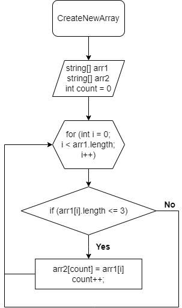

# Итоговая контрольная работа по основному блоку

***Задача:*** Написать программу, которая из имеющегося массива строк формирует новый массив из строк, длина которых меньше, либо равна 3 символам. Первоначальный массив можно ввести с клавиатуры, либо задать на старте выполнения алгоритма. При решении не рекомендуется пользоваться коллекциями, лучше обойтись исключительно массивами.

### Создадим блок-схему задачи:

### Алгоритм решения задачи:
1. Создается функция `CreateNewArray`, которая принимает два массива строк: `arr1` и `arr2`.
2. Внутри функции создается счетчик `count`, который будет отслеживать позицию во втором массиве `arr2`.
3. Запускается цикл `for`, который перебирает элементы массива `arr1` с помощью индекса `i`.
4. Для каждой строки в массиве `arr1`, проверяется её длина с помощью `arr1[i].Length`.
5. Если длина текущей строки меньше или равна 3 символам (по условию задачи), то выполняется следующее:
   - Строка копируется во второй массив `arr2` на позицию `count`.
   - Счетчик `count` увеличивается на 1, чтобы указать на следующую позицию во втором массиве `arr2`.
6. Функция `CreateNewArray` завершает свою работу, и во втором массиве `arr2` остаются только строки из массива `arr1`, которые удовлетворяют условию (длина меньше или равна 3 символам).
7. Затем используется функция `PrintArray`, которая выводит элементы второго массива `arr2` на консоль.